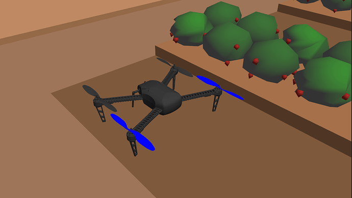
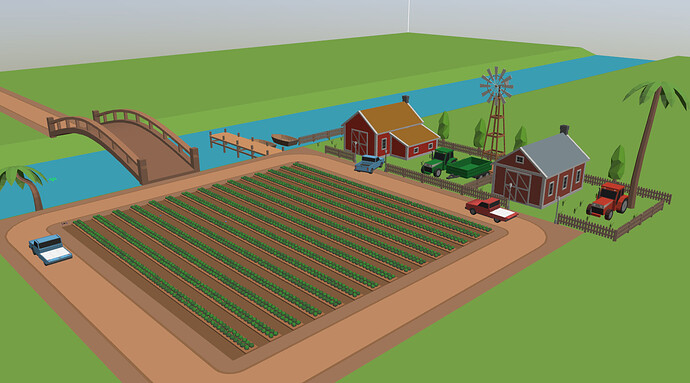

# Strawberry Stacker (SS)



## Problem Statement

Our problem statement consists of a team of multiple autonomous drones, tasked with identifying and picking boxes from in-between the strawberry rows and then stacking them in a palletized form onto two parked flatbed trucks.



## Software Specifications
For solving our problem statement we shall use PX4 Autopilot ecosystem for controlling the UAV, Gazebo simulator, a robotics simulator, where the simulated farm and UAV’s will reside, and ROS for integrating various aspects of autonomy required in the solution.
### 1. Ubuntu 20.04 LTS
- The operating system on which all the softwares run is Ubuntu 20.04. Since the package is run entirely in Gazebo 11 simulation, Ubuntu 20.04 is the only supported operating system

### 2. ROS Noetic
- Robot Operating System (ROS) is the framework which is used to integrate the components in the package. The version of ROS supported in the competition is Noetic.

### 3. Gazebo 11
- The entire package is to be implemented inside the Gazebo simulation environment
- The official version supported is Gazebo 11.xx.
- Gazebo 11 is tightly integrated with ROS Noetic and so it comes pre-installed when ```ros-noetic-desktop-full``` is installed

### 4. Python
- Python is the language in which the programs are written
- The version of Python supported with ROS Noetic is Python 3
- Hence all the python programs interfacing with ROS Noetic framework should be written in Python 3. Python 3 comes preinstalled with ROS Noetic

## Installation
- Install ROS Noetic and set up PX4 as given in [Task 0 README](task_0/README.md)
- Clone the repository in your workspace src folder.
    ```bash
    cd px4_ws/src
    git clone https://github.com/Shobuj-Paul/Strawberry-Stacker.git
    ```
- Build the package.
    ```bash
    cd ..
    catkin build
    ```

## Tasks
For each task package, README files are provided which give details about the problem statement and the task specifications. 
The video/image solutions are also added in the README files.
- [Task 0 - Python Contest](task_0/README.md)
- [Task 1 - Getting Started with ArUco and ROS](task_1/README.md)
- [Task 2 - Getting Started with PX4](task_2/README.md)
- [Task 3 - Pick and Place](task_3/README.md)
- [Task 4 - Pick and Place Using Multiple Drones](task_4/README.md)
- [Task 5 - Theme Implementation](task_5/README.md)
- [Task 6 - Final Theme Implementation](task_6/README.md)
