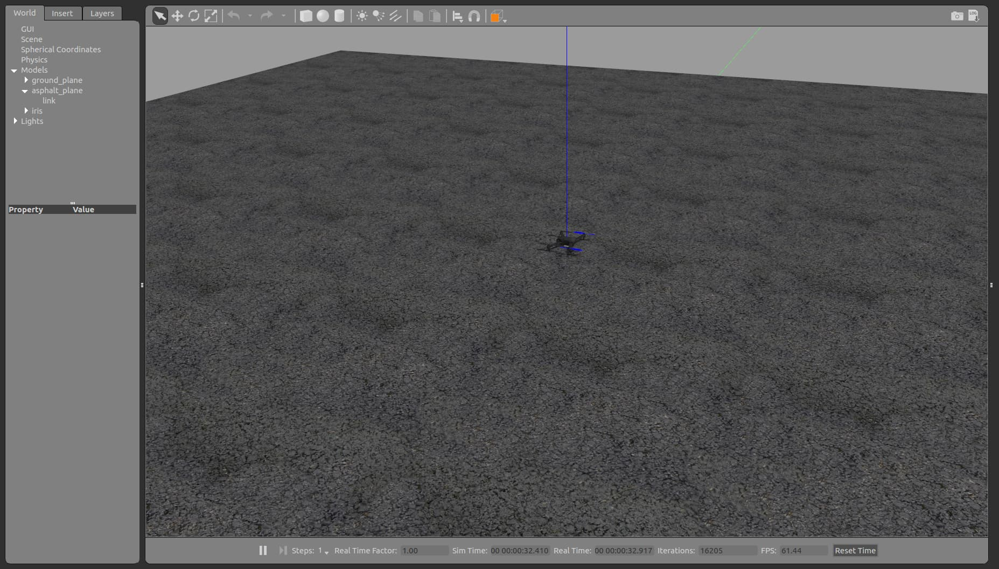

# Task 0: Installation and Setup

### ROS Noetic Installation:
Follow this ROSWiki link for full ROS Noetic installation: [ROS Noetic Installation on Ubuntu 20.04](http://wiki.ros.org/noetic/Installation/Ubuntu).

### General Dependencies:
To use all provided utilities, there are some packages you need to install first. Copy and paste the following commands into your terminal:

```bash
sudo apt install -y \
	ninja-build \
	exiftool \
	python3-empy \
	python3-toml \
	python3-numpy \
	python3-yaml \
	python3-dev \
	python3-pip \
	ninja-build \
	protobuf-compiler \
	libeigen3-dev \
	genromfs \
    libignition-rendering3 \
    libgstreamer-plugins-base1.0-dev \
    gstreamer1.0-plugins-bad \
    gstreamer1.0-plugins-base \
    gstreamer1.0-plugins-good \
    gstreamer1.0-plugins-ugly
```

```bash
pip3 install \
	pandas \
	jinja2 \
	pyserial \
	cerberus \
	pyulog \
	numpy \
	toml \
	pyquaternion \
    kconfiglib \
    --user packaging \
    --user jsonschema
```

### MAVROS Installation:
MAVROS is a communication node based on MAVLink for ROS that is specially designed for communication between the drone and the companion computer. To install it, follow the following instructions:

```bash 
sudo apt install python3-catkin-tools python3-rosinstall-generator python3-osrf-pycommon -y 
```

**Step 1.** Create the workspace:
```bash
mkdir -p ~/px4_ws/src
cd ~/px4_ws
catkin init
wstool init src
```

**Step 2.** Install MAVLink: we use the Kinetic reference for all ROS distros as it’s not distro-specific and up to date
```bash
rosinstall_generator --rosdistro kinetic mavlink | tee /tmp/mavros.rosinstall
```

**Step 3.** Install MAVROS: get source (upstream - released)
```bash
rosinstall_generator --upstream mavros | tee -a /tmp/mavros.rosinstall
```
Alternatively, you can get the latest development version:
```bash
rosinstall_generator --upstream-development mavros | tee -a /tmp/mavros.rosinstall
```

**Step 4.** Create workspace & deps
```bash
wstool merge -t src /tmp/mavros.rosinstall
wstool update -t src -j4
rosdep install --from-paths src --ignore-src -y
```
**Step 5.** Install GeographicLib datasets:
```bash
sudo ./src/mavros/mavros/scripts/install_geographiclib_datasets.sh
```

**Step 6.** Build source
```bash
catkin build
```

**Step 7.** Make sure that you use setup.bash
```bash
source devel/setup.bash
```

### PX4 Firmware Installation:

Clone the PX4 Repository:
```bash
cd ~/px4_ws/src
git clone https://github.com/PX4/PX4-Autopilot.git --recursive
cd PX4-Autopilot/
make px4_sitl_default gazebo
```
>Current versions of PX4 require an additional command to function properly. After cloning the PX4 repo and before building the workspace, cd into it
>```bash
>cd ~/catkin_ws/src/PX4-Autopilot
>```
>and then run
>```bash
>DONT_RUN=1 make px4_sitl_default gazebo
>```
>This command enables PX4 to configure itself for working with Gazebo.

Now you should see a window pop out and a drone in the middle of the environment. After verifying, press Control-C in the command line to quit Gazebo and close the window.

### PX4 Enviroment:


Build you workspace:
```bash
cd ~/px4_ws
catkin build
```
Some extra tools to install:

```bash
pip3 install px4tools pymavlink
```

Modifying your ‘bashrc’ so that your environment remains the same every time you open a new terminal:
```bash
source ~/px4_ws/devel/setup.bash
source ~/px4_ws/src/PX4-Autopilot/Tools/setup_gazebo.bash ~/px4_ws/src/PX4-Autopilot/ ~/px4_ws/src/PX4-Autopilot/build/px4_sitl_default
export ROS_PACKAGE_PATH=$ROS_PACKAGE_PATH:~/px4_ws/src/PX4-Autopilot
export ROS_PACKAGE_PATH=$ROS_PACKAGE_PATH:~/px4_ws/src/PX4-Autopilot/Tools/sitl_gazebo
```